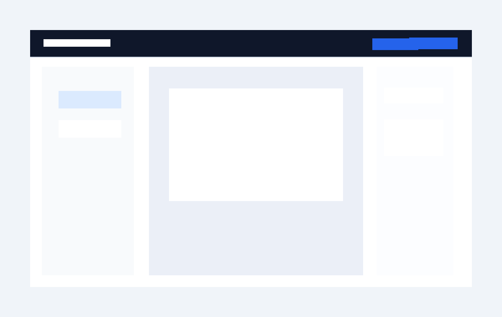
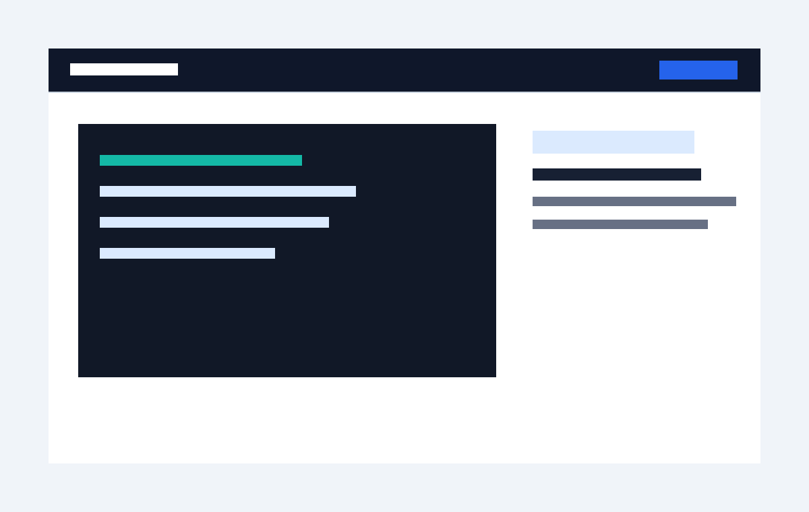
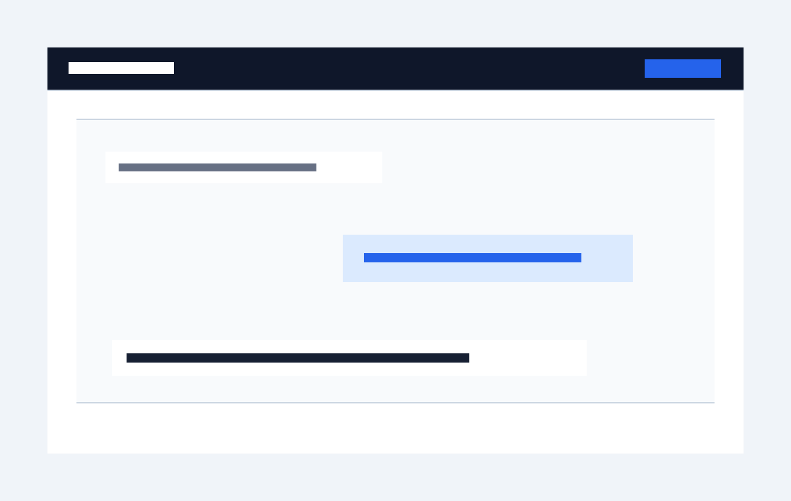

# Stepglyph

Stepglyph turns Codex Computer Use sessions into editable visual guides.

Use your normal Codex chat, ask Codex to use Stepglyph, and Stepglyph records
only the explicit steps Codex sends to the local recorder. When the task is
done, open Studio, fix the guide, and export Markdown, HTML, or JSON.

Stepglyph is local-first. It does not run a background screen recorder.



## What It Does

- Records explicit Codex workflow steps through `start`, `capture`, and
  `finish`.
- Stores screenshots, step text, targets, and annotations as local project data.
- Opens a local Studio for reviewing and editing the captured guide.
- Exports portable documentation as Markdown, HTML, and JSON.
- Keeps raw screenshots clean; annotations stay editable data.

## Quick Start

Clone the project, install dependencies, verify the build, and start the local
recorder plus Studio service.

```bash
npm install
npm test
npm run build
npm run dev
```

The dev server starts on:

```txt
http://127.0.0.1:4317
```



## Use It With Codex

Open your normal Codex session and ask:

```txt
Use Stepglyph to record this workflow as an editable guide.
```

Codex should follow the skill in [packages/codex-skill/SKILL.md](packages/codex-skill/SKILL.md):

1. Start a session with `POST /api/sessions/start`.
2. Capture only meaningful documentation moments with
   `POST /api/sessions/:id/capture`.
3. Finish with `POST /api/sessions/:id/finish`.
4. Give you the Studio URL.



## Edit And Export

Open the Studio URL returned by the recorder. In Studio you can:

- Select steps from the sidebar.
- Edit titles and descriptions.
- Mark steps as hidden or sensitive.
- Move annotation targets by clicking the screenshot.
- Change labels, marker type, marker color, and visibility.
- Reorder, duplicate, or delete steps.
- Export Markdown, HTML, and JSON.


## Recorder API

Start a session:

```bash
curl -s http://127.0.0.1:4317/api/sessions/start \
  -H 'content-type: application/json' \
  -d '{"title":"Account settings workflow"}'
```

Capture a step:

```json
{
  "action": "click",
  "title": "Open account settings",
  "description": "Select account settings from the sidebar.",
  "screenshot": {
    "kind": "png-base64",
    "data": "<base64-png>",
    "width": 1440,
    "height": 900,
    "deviceScaleFactor": 1
  },
  "target": {
    "kind": "point",
    "x": 0.18,
    "y": 0.42
  },
  "sensitive": false
}
```

Finish and export:

```bash
curl -s http://127.0.0.1:4317/api/sessions/<session-id>/finish \
  -H 'content-type: application/json' \
  -d '{}'

curl -s http://127.0.0.1:4317/api/projects/<project-id>/export \
  -H 'content-type: application/json' \
  -d '{"formats":["markdown","html","json"]}'
```

## Project Output

A recording becomes a local project directory:

```txt
.stepglyph/projects/<project-id>/
  project.json
  steps.json
  captures/
    step-001.png
    step-002.png
  exports/
    guide.md
    guide.html
    project.json
    steps.json
```

See [docs/data-format.md](docs/data-format.md) for the schema.

## Regenerate This README Guide

This README uses screenshots and guide text generated through Stepglyph's own
recorder/export flow. With the dev server running, regenerate them with:

```bash
npm run record:readme
```

The command records a new Stepglyph project through the local API, exports it,
and updates:

- [docs/assets/readme](docs/assets/readme)
- [docs/generated/stepglyph-readme-guide.md](docs/generated/stepglyph-readme-guide.md)
- [docs/generated/stepglyph-readme-recording.json](docs/generated/stepglyph-readme-recording.json)

## Packages

- `@stepglyph/core`: schemas, storage, and export functions.
- `@stepglyph/recorder-server`: localhost API for explicit capture.
- `@stepglyph/cli`: developer entrypoint for the local service.
- `@stepglyph/studio`: local web editor.
- `packages/codex-skill`: Codex skill instructions.

## Privacy Model

Stepglyph is designed around trust:

- No background screen recording.
- No timer-based screenshots.
- No cloud upload by default.
- Screenshots stay local.
- Capture happens only when Codex calls the recorder.
- Typed values should be summarized or redacted.
- Sensitive steps can be flagged before export.

See [docs/privacy.md](docs/privacy.md).
