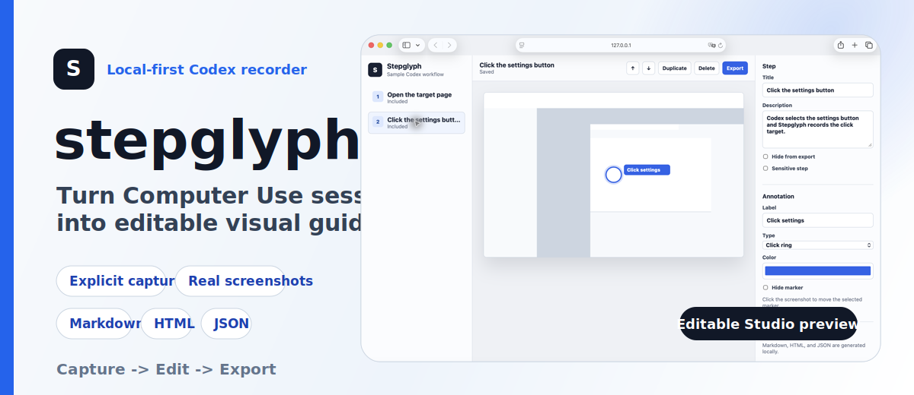

# stepglyph

English | [繁體中文](./README.zh-TW.md)

[](./LICENSE)
[](https://nodejs.org)
[](https://github.com/Ruxiu0409/stepglyph)

A local-first Codex Computer Use recorder that turns real UI work into editable visual guides.

Stop throwing away the useful parts of Computer Use sessions. `stepglyph`
captures only the explicit steps Codex sends to a local recorder, stores the
screenshots as project data, and opens a Studio where humans can clean up the
guide before exporting Markdown, HTML, or JSON.

It does not run a background screen recorder, upload screenshots by default, or
try to replace your normal Codex chat. It adds a small documentation layer around
the moments you intentionally capture.

```bash
git clone https://github.com/Ruxiu0409/stepglyph.git
cd stepglyph
npm install
npm run dev
```

## Why stepglyph

Computer Use is great at doing work, but the useful explanation of that work can
vanish as soon as the session ends.

The classic failure:

1. Codex opens the target app and completes the workflow.
2. The important UI states were visible only for a few seconds.
3. You later need a guide, bug report, onboarding doc, or changelog.
4. You recreate screenshots and text by hand from memory.

`stepglyph` adds an explicit capture step while the work is happening. Codex can
send screenshots, target coordinates, step titles, and notes to a localhost
recorder, then you refine the result in Studio.

## Highlights

### Explicit capture only

The recorder accepts `start`, `capture`, and `finish` events. Nothing is recorded
on a timer, and there is no always-on screen capture loop.

### Real screenshots, editable annotations

Screenshots are stored as clean PNG files. Markers, labels, target coordinates,
sensitive flags, and export visibility stay as editable JSON data.

### Local Studio

Studio runs on `127.0.0.1` and lets you review the captured guide, edit step
copy, move annotation targets, reorder steps, duplicate steps, delete noise, and
export the final artifact.

### Codex skill included

The repository includes [packages/codex-skill/SKILL.md](packages/codex-skill/SKILL.md),
so Codex can be instructed to use the local recorder from an ordinary chat.

### Portable exports

Each project can export Markdown, HTML, annotated PNG assets, the full project
JSON, and simplified steps JSON. The raw screenshots remain local files.

## Get started

Clone the project, install dependencies, run the checks, and start the local
recorder plus Studio service:

```bash
npm install
npm test
npm run build
npm run dev
```

The dev server starts on:

```txt
http://127.0.0.1:4317
```

Studio opens with a built-in sample project so you can try the editing and
export flow immediately.

## Use it with Codex

Open your normal Codex session and ask:

```txt
Use Stepglyph to record this workflow as an editable guide.
```

Codex should follow the included skill:

1. Start a session with `POST /api/sessions/start`.
2. Capture only meaningful documentation moments with
   `POST /api/sessions/:id/capture`.
3. Finish with `POST /api/sessions/:id/finish`.
4. Give you the Studio URL.

The captured click markers and inspector fields remain editable in Studio.

## Edit and export

Open the Studio URL returned by the recorder. In Studio you can:

- Select steps from the sidebar.
- Edit titles and descriptions.
- Mark steps as hidden or sensitive.
- Move annotation targets by clicking the screenshot.
- Change labels, marker type, marker color, and visibility.
- Reorder, duplicate, or delete steps.
- Export Markdown, HTML, and JSON.

## Workflow

```txt
Codex chat
    |
    v
Codex uses packages/codex-skill/SKILL.md
    |
    v
POST /api/sessions/start
    |
    v
POST /api/sessions/:id/capture for intentional moments
    |
    v
POST /api/sessions/:id/finish
    |
    v
Review in local Studio
    |
    v
Export Markdown, HTML, and JSON
```

## Recorder API

Start a session:

```bash
curl -s http://127.0.0.1:4317/api/sessions/start \
  -H 'content-type: application/json' \
  -d '{"title":"Account settings workflow"}'
```

Capture a step:

```json
{
  "action": "click",
  "title": "Open account settings",
  "description": "Select account settings from the sidebar.",
  "screenshot": {
    "kind": "png-base64",
    "data": "<base64-png>",
    "width": 1440,
    "height": 900,
    "deviceScaleFactor": 1
  },
  "target": {
    "kind": "point",
    "x": 0.18,
    "y": 0.42
  },
  "sensitive": false
}
```

Finish and export:

```bash
curl -s http://127.0.0.1:4317/api/sessions/<session-id>/finish \
  -H 'content-type: application/json' \
  -d '{}'

curl -s http://127.0.0.1:4317/api/projects/<project-id>/export \
  -H 'content-type: application/json' \
  -d '{"formats":["markdown","html","json"]}'
```

## Project output

A recording becomes a local project directory:

```txt
.stepglyph/projects/<project-id>/
  project.json
  steps.json
  captures/
    step-001.png
    step-002.png
  exports/
    assets/
      step-001-annotated.png
    guide.md
    guide.html
    project.json
    steps.json
```

The canonical schema is defined in [packages/core/src/schema.ts](packages/core/src/schema.ts).

## Commands

| Command | Purpose |
| --- | --- |
| `npm run dev` | Start the local recorder server and Studio. |
| `npm test` | Run unit and e2e tests with Vitest. |
| `npm run typecheck` | Type-check every workspace package. |
| `npm run build` | Build the core, recorder server, Studio, and CLI packages. |
| `npm run record:readme` | Replay real Computer Use screenshots through the recorder and regenerate annotated README guide assets. |

## Repo layout

| Path | Description |
| --- | --- |
| `packages/core` | Schemas, storage, capture normalization, and export functions. |
| `packages/recorder-server` | Express localhost API for explicit capture and Studio project loading. |
| `packages/cli` | Developer entrypoint for running the local service. |
| `apps/studio` | React/Vite local editor for reviewing and exporting captured guides. |
| `packages/codex-skill` | Codex skill instructions for using the recorder intentionally. |
| `fixtures/sample-project` | Built-in real Safari walkthrough loaded by Studio as `sample-project`. |
| `fixtures/readme-computer-use` | Real Computer Use screenshots used to regenerate this README. |

## Regenerate this README guide

This README uses real Computer Use screenshots from a clean local Safari window.
Those screenshots are replayed through `stepglyph`'s own recorder/export flow so
the local generated guide exercises the same API and exporters users run locally.

With the dev server running:

```bash
npm run record:readme
```

The command records a new project through the local API using the PNG fixtures in
[fixtures/readme-computer-use](fixtures/readme-computer-use), exports it, and
writes ignored local artifacts under `docs/`.

## Development

```bash
npm install
npm test
npm run typecheck
npm run build
npm run dev
```

This project is currently an npm workspace MVP with a React Studio, Express
recorder API, and TypeScript core package.

## Privacy model

`stepglyph` is designed around trust:

- No background screen recording.
- No timer-based screenshots.
- No cloud upload by default.
- Screenshots stay local.
- Capture happens only when Codex calls the recorder.
- Typed values should be summarized or redacted.
- Sensitive steps can be flagged before export.

## Positioning

`stepglyph` is not a task runner, browser automation framework, video recorder,
cloud screenshot service, or replacement for Codex.

It is a local documentation companion for Computer Use: small enough to run from
a cloned repository, explicit enough to avoid surprise recording, and editable
enough that a human can turn raw agent work into a guide worth sharing.

## License

MIT
