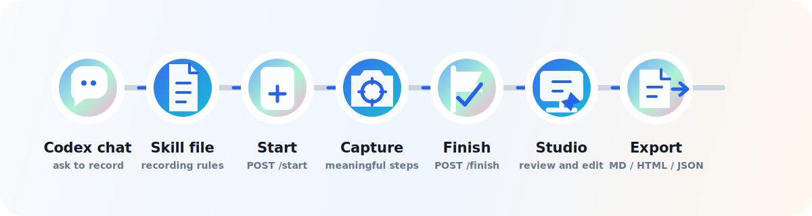

# Stepglyph

[English](./README.md) | 繁體中文

[](./LICENSE)
[](https://nodejs.org)
[](https://github.com/Stepglyph/Stepglyph)

一個 local-first 的 Codex Computer Use 錄製工具，把真實 UI 操作轉成可編輯的視覺化教學文件。

不要再讓 Computer Use session 裡有用的操作脈絡消失。`stepglyph`
只會擷取 Codex 明確送到本機 recorder 的步驟，把截圖存成專案資料，並開啟 Studio
讓人可以整理內容，再匯出 Markdown、HTML 或 JSON。

它不會背景錄影、不會定時截圖，也不會預設上傳截圖。它是在你刻意擷取的時刻，為一般 Codex
對話加上一層小而明確的文件化流程。

```bash
git clone https://github.com/Stepglyph/Stepglyph.git
cd Stepglyph
npm install
npm run dev
```

## 為什麼需要 stepglyph

Computer Use 很適合完成實際操作，但操作過程中最有價值的說明常常會在 session 結束後消失。

常見情境是：

1. Codex 打開目標 app 並完成流程。
2. 重要 UI 狀態只出現幾秒鐘。
3. 之後你需要教學文件、bug report、onboarding doc 或 changelog。
4. 你只能靠記憶重新截圖和補文字。

`stepglyph` 讓 Codex 在工作進行中明確擷取重要步驟。Codex 可以把截圖、目標座標、步驟標題和備註送到 localhost recorder，接著你再到 Studio 裡整理成可分享的 guide。

## 特色

### 只在明確要求時擷取

Recorder 接受 `start`、`capture` 和 `finish` 事件。它不會定時錄製，也沒有常駐的螢幕擷取流程。

### 真實截圖，可編輯標註

截圖會以乾淨的 PNG 檔保存。Marker、label、目標座標、sensitive flag 和 export visibility 都保留為可編輯的 JSON 資料。

### 本機 Studio

Studio 跑在 `127.0.0.1`，可以用來檢視擷取到的 guide、編輯步驟文字、移動標註目標、重新排序、複製或刪除步驟，並匯出最後成果。

### 內建 Codex skill

Repository 內含 [packages/codex-skill/SKILL.md](packages/codex-skill/SKILL.md)，因此 Codex 可以在一般對話中照著這份 skill 使用本機 recorder。

### 可攜式匯出

每個專案都可以匯出 Markdown、HTML、annotated PNG assets、完整 project JSON 和簡化版 steps JSON。原始截圖會留在本機檔案中。

## 快速開始

Clone 專案、安裝依賴、執行檢查，然後啟動本機 recorder 與 Studio：

```bash
npm install
npm test
npm run build
npm run dev
```

Dev server 會啟動在：

```txt
http://127.0.0.1:4317
```

Studio 會開啟內建 sample project，讓你可以直接試用編輯和匯出流程。

## 搭配 Codex 使用

在一般 Codex session 中說：

```txt
Use Stepglyph to record this workflow as an editable guide.
```

Codex 應該依照內建 skill：

1. 透過 `POST /api/sessions/start` 開始 session。
2. 只在有文件價值的時刻呼叫 `POST /api/sessions/:id/capture`。
3. 透過 `POST /api/sessions/:id/finish` 結束 session。
4. 回傳 Studio URL 給你。

被擷取的 click marker 和 inspector 欄位都可以在 Studio 裡繼續編輯。

## 編輯與匯出

打開 recorder 回傳的 Studio URL。你可以在 Studio 裡：

- 從 sidebar 選擇步驟。
- 編輯 title 和 description。
- 將步驟標記為 hidden 或 sensitive。
- 點擊截圖來移動 annotation target。
- 修改 label、marker type、marker color 和 visibility。
- 重新排序、複製或刪除步驟。
- 匯出 Markdown、HTML 和 JSON。

## 工作流程



## Recorder API

開始 session：

```bash
curl -s http://127.0.0.1:4317/api/sessions/start \
  -H 'content-type: application/json' \
  -d '{"title":"Account settings workflow"}'
```

擷取步驟：

```json
{
  "action": "click",
  "title": "Open account settings",
  "description": "Select account settings from the sidebar.",
  "screenshot": {
    "kind": "png-base64",
    "data": "<base64-png>",
    "width": 1440,
    "height": 900,
    "deviceScaleFactor": 1
  },
  "target": {
    "kind": "point",
    "x": 0.18,
    "y": 0.42
  },
  "sensitive": false
}
```

結束並匯出：

```bash
curl -s http://127.0.0.1:4317/api/sessions/<session-id>/finish \
  -H 'content-type: application/json' \
  -d '{}'

curl -s http://127.0.0.1:4317/api/projects/<project-id>/export \
  -H 'content-type: application/json' \
  -d '{"formats":["markdown","html","json"]}'
```

## 專案輸出

一次 recording 會變成本機專案資料夾：

```txt
.stepglyph/projects/<project-id>/
  project.json
  steps.json
  captures/
    step-001.png
    step-002.png
  exports/
    assets/
      step-001-annotated.png
    guide.md
    guide.html
    project.json
    steps.json
```

Canonical schema 定義在 [packages/core/src/schema.ts](packages/core/src/schema.ts)。

## 指令

| 指令 | 用途 |
| --- | --- |
| `npm run dev` | 啟動本機 recorder server 和 Studio。 |
| `npm test` | 用 Vitest 執行 unit 和 e2e tests。 |
| `npm run typecheck` | 對所有 workspace package 做 type check。 |
| `npm run build` | Build core、recorder server、Studio 和 CLI packages。 |
| `npm run record:readme` | 透過 recorder replay 真實 Computer Use 截圖，並重新產生 annotated README guide assets。 |

## Repository 結構

| 路徑 | 說明 |
| --- | --- |
| `packages/core` | Schemas、storage、capture normalization 和 export functions。 |
| `packages/recorder-server` | 明確擷取與 Studio project loading 用的 Express localhost API。 |
| `packages/cli` | 啟動本機服務的 developer entrypoint。 |
| `apps/studio` | 用來檢視和匯出 captured guides 的 React/Vite 本機 editor。 |
| `packages/codex-skill` | 讓 Codex 有意識地使用 recorder 的 skill instructions。 |
| `fixtures/sample-project` | Studio 內建的 `sample-project` 真實 Safari 教學。 |
| `fixtures/readme-computer-use` | 用來重新產生 README guide 的真實 Computer Use 截圖。 |

## 重新產生 README guide

這份 README 使用從乾淨本機 Safari 視窗擷取的真實 Computer Use 截圖。這些截圖會透過
`stepglyph` 自己的 recorder/export flow replay，讓本機生成的 guide 走過和使用者相同的 API 與 exporters。

Dev server 啟動後執行：

```bash
npm run record:readme
```

這個指令會使用 [fixtures/readme-computer-use](fixtures/readme-computer-use) 裡的 PNG fixtures，透過本機 API 建立新專案、執行 export，並把被忽略的本機 artifacts 寫到 `docs/`。

## 開發

```bash
npm install
npm test
npm run typecheck
npm run build
npm run dev
```

目前這是一個 npm workspace MVP，包含 React Studio、Express recorder API 和 TypeScript core package。

## 隱私模型

`stepglyph` 的設計以信任為核心：

- 不做背景螢幕錄影。
- 不做定時截圖。
- 預設不上傳到雲端。
- 截圖留在本機。
- 只有 Codex 呼叫 recorder 時才會擷取。
- 輸入過的值應該摘要化或遮蔽。
- Sensitive steps 可以在 export 前標記。

## 定位

`stepglyph` 不是 task runner、browser automation framework、video recorder、cloud screenshot service，也不是 Codex 的替代品。

它是 Computer Use 的本機文件化 companion：小到可以從 cloned repository 直接跑，明確到不會意外錄製，也足夠可編輯，讓人可以把 agent 的原始操作整理成值得分享的 guide。

## License

MIT
